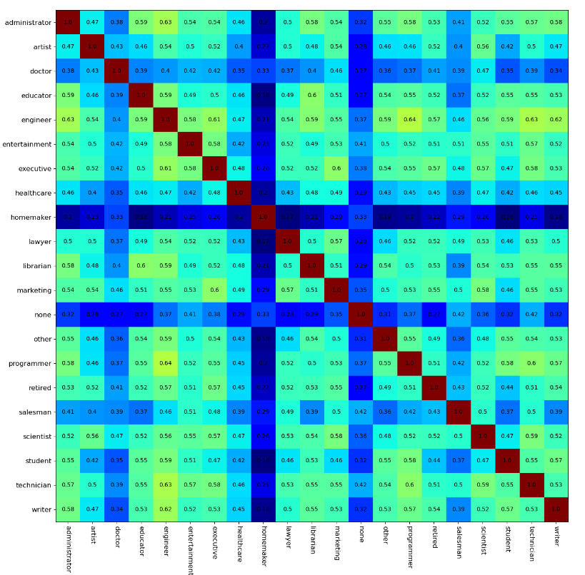
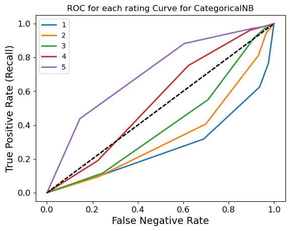
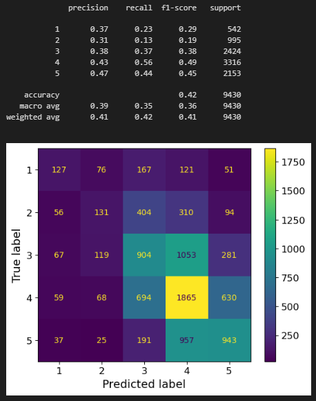

# MovLensDataSet
recommender systems models

This is a fork from https://github.com/Reactodactyl/MovLensDataSet.

This project is made by Xevenst(me), Reactodactyl, Scarstreet, and Zelxic as a University class assignment.

You can check out the people doing this project with me:
Reactodactyl: https://github.com/Reactodactyl
Scarstreet : https://github.com/scarstreet
Zelxic: https://github.com/Zelxic

The motivation of this project is to compare which method is the best for this type of dataset.

The dataset is collected from GroupLens Research website : https://grouplens.org/datasets/movielens/100k/

The project has:
  - Data Analysis that compares the correlation between users or items.
  - Models and clusterings including Kmeans, Naive Bayes.
  - For each result from the models, has analysis including: precision recall + curve, similarity matrix, ROC curve

Some of the screenshots:

Data Analysis

ROC Curve

Similarity Matrix, after training

